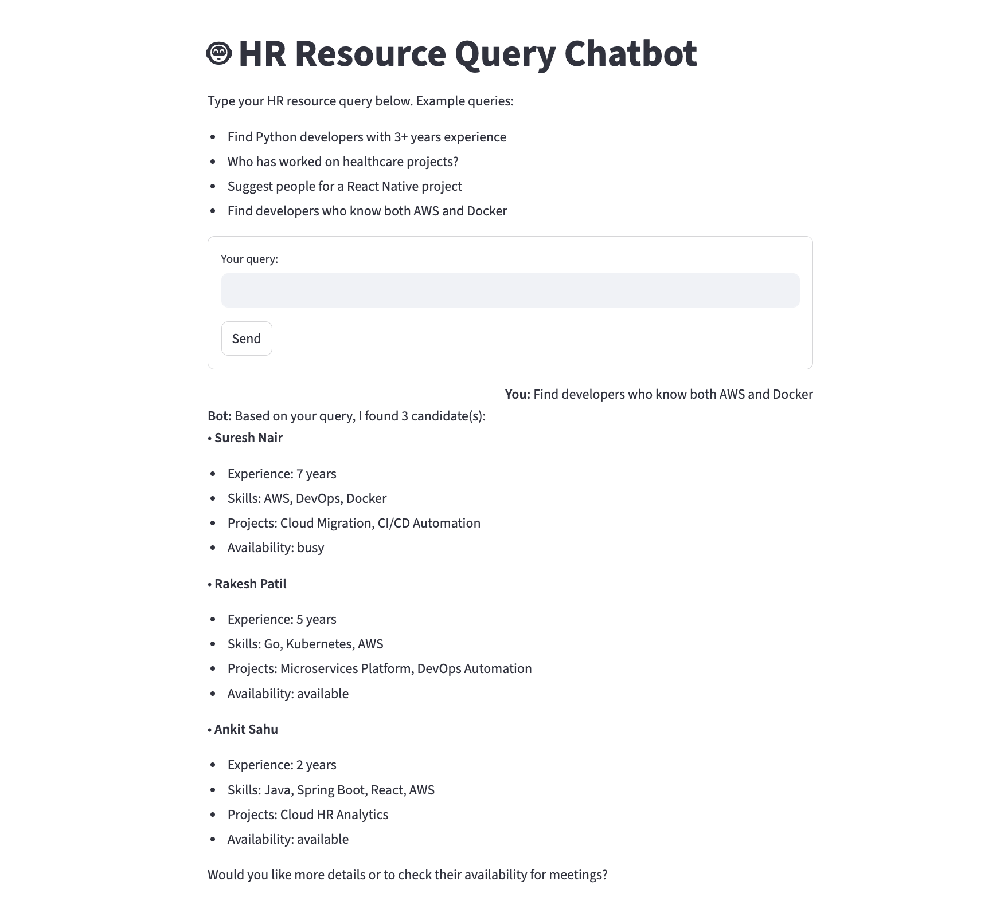

# HR Resource Query Chatbot

## Overview
The HR Resource Query Chatbot is an intelligent assistant designed to help HR teams quickly find and recommend employees for projects using natural language queries. It leverages modern retrieval-augmented generation (RAG) techniques, semantic search, and (optionally) LLMs to provide relevant, human-like recommendations based on a realistic employee dataset. This project is intended for **local setup and demonstration only**.

## Features
- Natural language HR resource search via chat interface
- RAG pipeline: semantic retrieval + augmentation + generation
- Vector similarity search using FAISS and sentence-transformers
- Template-based and LLM-based (OpenAI GPT) response generation
- REST API with endpoints for chat and employee search
- Streamlit frontend for interactive chat
- Realistic, diverse employee dataset (50+ entries)
- Modular, extensible codebase

## Architecture
- **Backend:** FastAPI app with RAG pipeline (retrieval, augmentation, generation)
- **Frontend:** Streamlit chat UI
- **Embeddings:** sentence-transformers (MiniLM)
- **Vector Search:** FAISS (in-memory)
- **LLM (optional):** OpenAI GPT-3.5/4 (if API key provided)
- **Data:** JSON file with employee profiles

**System Flow:**
```
User ──▶ Streamlit UI ──▶ FastAPI /chat ──▶ RAG Pipeline ──▶ Employee Data
```

## Setup & Installation

### Prerequisites
- Python 3.8+
- (Optional) OpenAI API key for LLM responses

### Backend
```bash
cd backend
python -m venv venv
source venv/bin/activate
pip install -r requirements.txt
uvicorn main:app --reload
```

### Frontend
```bash
cd frontend
python -m venv venv
source venv/bin/activate
pip install -r requirements.txt
streamlit run app.py
```

### Configuration
- To use OpenAI, set `OPENAI_API_KEY` in your environment before starting the backend.
- The frontend will connect to the backend at `http://localhost:8000` by default.

## API Documentation

### POST `/chat`
- **Description:** Query the chatbot for employee recommendations.
- **Request:**
  ```json
  { "query": "Find Python developers with 3+ years experience" }
  ```
- **Response:**
  ```json
  { "response": "..." }
  ```

### GET `/employees/search`
- **Description:** Search employees by skills, experience, availability, or project.
- **Query params:** `skills`, `min_experience`, `availability`, `project`
- **Example:** `/employees/search?skills=Python&min_experience=3`
- **Response:**
  ```json
  [ { "id": 1, "name": "Amit Sharma", ... }, ... ]
  ```

## AI Development Process
- **AI Coding Assistants Used:** Cursor AI, GitHub Copilot, ChatGPT
- **How AI Helped:**
  - Code generation for FastAPI, Streamlit, and RAG pipeline
  - Debugging and error resolution
  - Architecture planning and best practices
  - Writing and formatting documentation
- **AI vs Hand-written Code:** ~60% AI-assisted, 40% hand-written (data, edge cases, integration)
- **Interesting AI Solutions:**
  - Modular RAG pipeline with fallback to template
  - Automatic switch to template if LLM quota exceeded
  - Realistic, diverse employee data generation
- **Manual Challenges:**
  - Data realism and diversity
  - Error handling for local-only setup
  - Ensuring clear local setup for reviewers

## Technical Decisions
- **OpenAI vs Open-source Models:**
  - OpenAI GPT used for best-in-class LLM responses (optional, local fallback always available)
  - Chose sentence-transformers + FAISS for free, fast, local semantic search
- **Local LLM vs Cloud API:**
  - Local setup prioritized for privacy and ease of review
  - Cloud LLM (OpenAI) is optional and only used if API key is provided
- **Performance vs Cost vs Privacy:**
  - Default is local, no-cost, privacy-friendly
  - LLM is opt-in for richer responses

## Future Improvements
- User authentication (HR login)
- Employee profile enrichment (CVs, LinkedIn integration)
- Meeting scheduling and calendar integration
- Feedback/rating system for recommendations
- Local LLM (Ollama, HuggingFace) integration
- Analytics dashboard for HR insights

## Demo
  
- **This project is intended for local demonstration only.**
- To see the app in action, follow the setup instructions above and view the included screenshots.
- For a live demo, contact the author to arrange a screen share or request a screen recording.

---
For questions or support, contact the author. 
